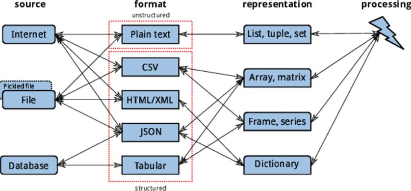

# Python para Análise de Dados

Pipeline de Aquisição de Dados em Python    

# Python - Estruturas básicas para Análise de Dados
1. Lista
2. Tupla
3. Dicionário
4. Array, matriz (pacote Numpy, Scipy)
5. Dataframes, Series (pacote Pandas)
6. Strings
7. List compreension
8. Construção de uma Interface com um framework python

# Python - Pacotes Básicos
1. Numpy  
Pacote fundamental que suporta arrays e matrizes multidimensionais, possuindo uma larga coleção de funções matemáticas para trabalhar com estas estruturas   
2. Pandas   
Pacote para manipulação e análise de dados. Em particular, oferece estruturas de dados e operações para manipular tabelas numéricas e séries temporais.   
3. Scipy   
É uma biblioteca Open Source em linguagem Python que foi feita para matemáticos, cientistas e engenheiros.   

# Python - Pacotes para Análise de Dados
1. Scikit-learn (Machine Learning)
2. Statsmodels (Estatística)
3. Matplotlib (Gráficos)
4. Seaborn (Gráficos)
5. ggplot2 (Gráficos)
6. Geopandas (Mapas com Dataframes)
7. Folium (Mapas)
8. Sttreamlit - interface com um framework python
   
# Cursos de Python para análise dados

Recomendo o curso da DataScienceAcademy (Gratuito e completo)  
Python fundamentos para a análise de dados  
https://www.datascienceacademy.com.br/path-player?courseid=python-fundamentos

Tutorial Points:  
http://www.tutorialspoint.com/python/python_quick_guide.htm

Pandas:  
http://pandas.pydata.org/pandas-docs/stable/10min.html

