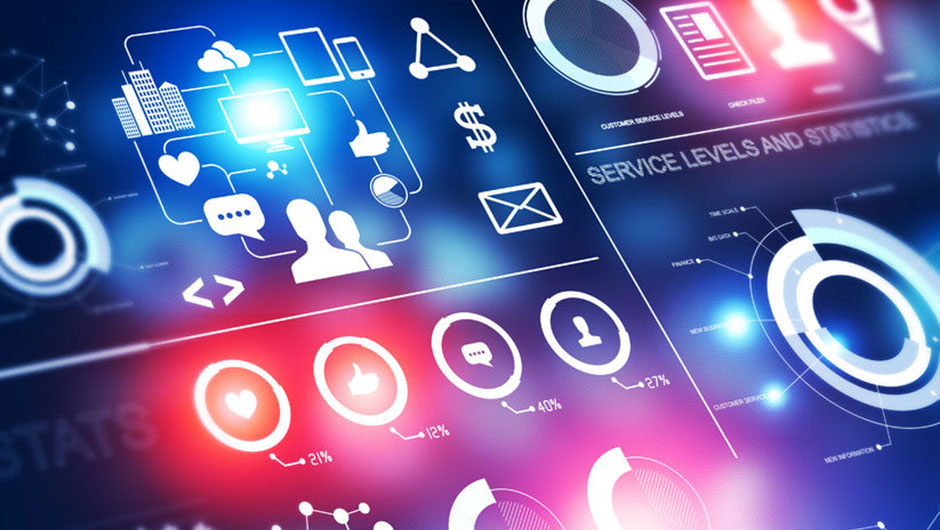

# Curso: Introdução à Ciência de Dados e Big Data 
Prof. Dr. Vladimir Costa de Alencar: webpage: https://www.valencar.com/topicos-especiais-em-banco-de-dados   

Conteúdo Programático    
1. Introdução (Motivação)     
1.2. O que é Ciência de Dados (Data Science) ?  
Conceitos  
Que profissão é essa  
Organizações Data Driven  
1.3. Linguagens usadas em Data Science  
Python, R, Java, Scala  
1.4. Curso Rápido de Python para Análise de Dados    

2. Data Science e Big Data      
Introdução  
O que é Big Data  
Modelos de Computação Distribuída    
3. Machine Learning, Mineração de Dados e Usos  
4. Machine Learning (Aprendizado de Máquina)     
(Aprendizado Supervisionado e Aprendizado não-Supervisionado)  
Fundamentação Teórica  
Algorítmos de ML    

5. Redes Neurais      
5.1. Componentes Básicos das Redes Neurais Artificiais - RNAs   
5.2. O Sistema Nervoso   
5.3. O Neurônio   
5.4. Sinapses   
5.5. Neurônio x Redes Neurais Artificiais   
5.6. Arquitetura   
5.7. O aprendizado   
5.8. Redes Perceptron   
5.9. Redes ADALINE – Regra Delta   
5.10. Perceptron Multicamadas - MLP   
5.11. Algoritmo BackPropagation   
5.12. Backpropagation – Ajuste de parâmetros  
5.13. Otimizadores – Regra Delta      

6.Deep Learning      
6.1.Introdução e conceitos básicos  
6.2.A Arquitetura das Redes Neurais   
6.3. Os principais tipos de Redes Neurais   
6.4. Frameworks de Deep Learning   
6.5. Programação paralela em GPU   
6.6 TensorFlow   
6.7 Keras     

7. Hadoop e Engenharia de Dados    

8. Spark    

9. Bancos de Dados NoSQL    

10. Introdução ao MongoDB    

11. Análise de Mídias Sociais   
Twitter, Facebook, Youtube, Instagram, Spotify, etc  

12. Processamento de Linguagem Natural (PLN)     
PLN e Análise de texto  

Twitter, Facebook, Youtube, Instagram, Spotify, etc   
11. Processamento de Linguagem Natural (PLN)  
PLN e Análise de texto  
