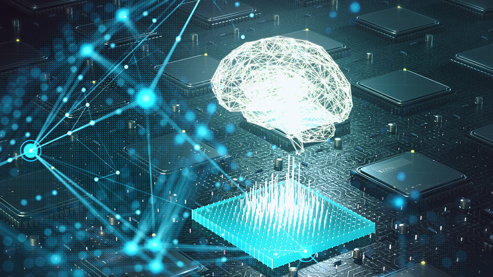

6. Deep Learning      
6.1. Introdução e conceitos básicos  
6.2. A Arquitetura das Redes Neurais   
6.3. Os principais tipos de Redes Neurais   
6.4. Frameworks de Deep Learning   
6.5. Programação paralela em GPU   
6.6  TensorFlow   
6.7  Keras     
